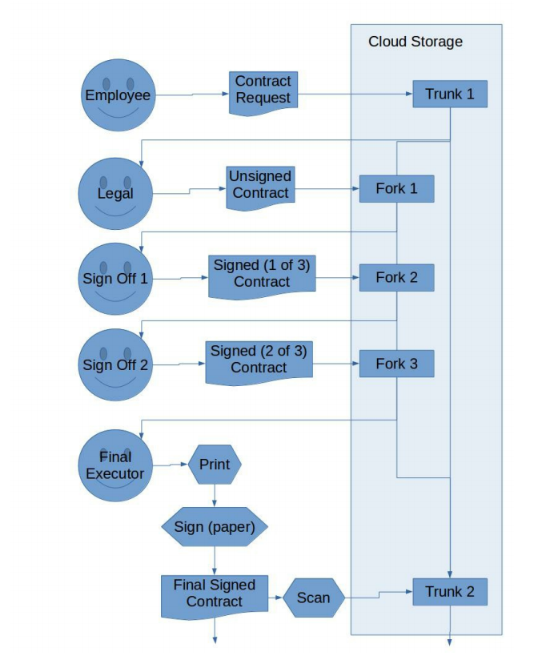

# Business Group Document Management

### Author: Ira Miller
### Email: public@iramiller.com
### Document Version: 0.0.3
### License: Creative Commons (CC-BY-4)
## Problem
Business groups face a number of challenges at the juncture of IT and
legal. If proper steps are not taken to capture and store every step of
contract execution, the consequences can be loss of business, bloated
operations, negligence, fraud, or even embezzlement.
## Solution
The lifecycle of a contract is request, writing, discussion, execution, and
finally storage. By utilizing git, a revision control file system, for all legal
documents, each of these steps can be recorded perfectly, including metadata
like author(s), signer(s), timestamps, and even supporting
identification for counter-parties, such as corporate email server signatures.
Additionally, the shared cloud-storage functionality of git will improve
workflows, reducing confusion over document version, and email chains.
Basically, the group can have a private dropbox, where every change to
every document is perfectly recorded, even if it was made by a third party.
## Technical Details
Git, well known through hosting service github, is used by every major
company and institution in the world, from the US Department of Defense to
Google. It is free, open source, and supported for every computer language
and operating system.
Though trustworthy companies like github offer enterprise hosting services,
it is trivial for an enterprise IT department to run their own git server. The
author would recommend gitolite to simplify management of a large number
of users.
#### User Experience
Seamless desktop integration is possible with git, so that a local directory
can be synchronized with the group. After setup, this should not require any
action on the part of the user, making the solution suitable for anyone from a
new secretary to a senior partner.
Anyone who has used Dropbox or Google Drive to share a local folder will
be able to use this cloud drive.
#### Contract lifecycle
The contract lifecycle with our git cloud server looks like each person 
opening and saving the file in order, until the final person prints and
physically signs the paper version. Because each time the file is opened
and saved, the digital signature of the user is recorded, no further action is
strictly necessary to indicate review and approval of the contract. As a
visual signal, typing in your name would be appropriate.

#### Users and Teams
Users can be organized into teams with group or individual permissions.
Gitolite allows this sort of configuration in a clear and secure manner.
In the context of a business group, it is recommended to create one or more
repository (shared folder) per company, and reflect corporate structure in
the user permissions. For those familiar with Fork/PR workflow, the goal is
to have the managers and business executives to merge changes into the
organization's master records from topic-based, working forks.
#### Security
Though git servers can identify users by open standards like SSH keys, the
author also recommends having each user generate a PGP key to use for
signing all file changes. This leaves a stronger trail of ownership, since PGP
signatures are stored in the git database, while SSH signatures are
discarded after server authentication. Each user device can be configured
to perform these signatures in the background upon file save.
PGP can also be used to encrypt files, for extra security. This could be
useful for corporate secrets that should not be known by employees,
including IT personnel. In fact, such encryption is the only way to keep a
secret from IT personnel.
## Implementation steps
To put this plan into action, take the following steps.
1. Set up a gitolite server for the group, preferably with backups.
2. Install git, a git UI on all workstations.
3. Generate SSH and PGP keys for each user and install on respective
workstations.
4. Create git repositories, users, and groups to map to corporate
structure.
5. Train employees on use of their new cloud storage system.
